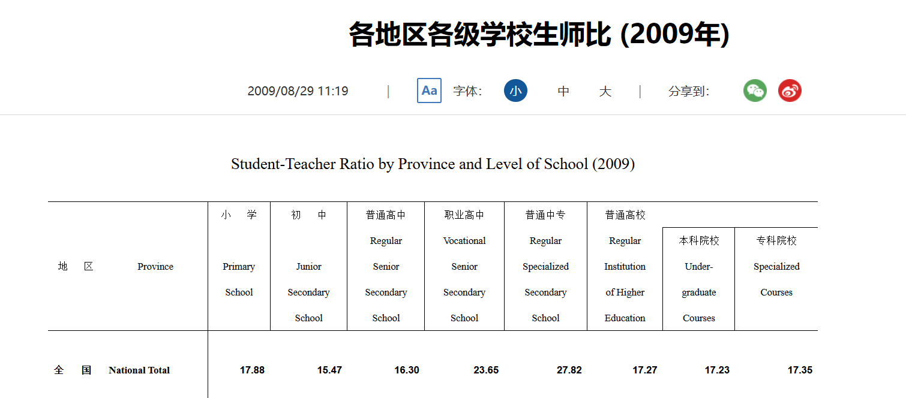

http://www.moe.gov.cn/jyb_sjzl/moe_560/2022/

http://www.moe.gov.cn/jyb_sjzl/moe_560/2022/quanguo/202401/t20240110_1099539.html

中国高等教育中的总学生数越为：57,000,000
中国高等教育中的总老师数为： 3500000
中国高等教育生师比（学生/老师）：17/1

2022年教育统计数据

                                           在校生数
                            	            Enrolment
	
一、高等教育 Higher Education	　	　	　
  1.研究生 Postgraduates	                  3653613
    博 士 Doctor´s Degree	 	                556065
    硕 士 Master´s Degree	                  3097548
  2.普通本科 Undergraduates		              19656436
  3.职业本专科          	                   16937739
    本 科              	                    228740
    专 科 	                                16708999
  4.成人本专科             	                 9336481
    本 科 Normal Courses	                  5277598
    专 科                                   4058883
  5.网络本专科生                             8446500
    本 科 Normal Courses		                3419642
    专 科 Short-cycle    	                  5026858

研究生（Postgraduates）：3,653,613人
普通本科（Undergraduates）：19,656,436人
职业本专科（Vocational Undergraduate）：16,937,739人
成人本专科（Undergraduate in Adult HEIs）：9,336,481人
网络本专科生（Web-based Undergraduates）：8,446,500人

2022各级各类学校校数、教职工情况

                    学校数(所)        教职工数(人)           
                    Schools	     Educational Personnel   

  高等教育学校 	       3013	            2870866	                
  1.普通本科院校 	     1239	            1976771	                        
  2.本科层次职业学校 	   32	             34196	              
  3.高职（专科）院校    1489	           832026	                
  4.成人高等学校 	      253	            27873	               

  学生/老师 = 57030769/2870866 = 11.7 

  高等教育普通本科学生数
  湖　北 Hubei	249208 + 1003610 = 1,252,818
  高等学校（机构）研究生数
  湖　北 Hubei	49567	+ 217095 = 266,662
  本研 总： 1,252,818 + 266,662 = 1,519,480

  高等教育职业本专科学生数
  湖　北 Hubei	222400 + 769001 = 991,401
  高等教育成人本专科学生数
  湖　北 Hubei	162738 + 406618 = 569,356
  高等教育网络本科、专科生学生数
  湖　北 Hubei	75803	+ 139489 = 215,292

  学生总： 1,519,480 + 991,401 + 569,356 + 215,292 = 3,295,529

  高等教育学校(机构）教职工情况（总计）
  湖　北 Hubei 143553+25032+20220+499+60851 = 250155 

  高等教育学校(机构）教职工情况（普通本科高校）
  湖　北 Hubei	108672+18191+10111+469+47271 = 184714

  湖北本研大学 学生/老师 = 1,519,480/184714 = 8.2
  湖北总      学生/老师 = 3,295,529/250155 = 13.2

  选取比例 学生/老师 = 10/1

https://www.stats.gov.cn/zt_18555/ztsj/hstjnj/sh2009/202303/t20230303_1926862.html
  
  

http://www.moe.gov.cn/jyb_sjzl/moe_560/jytjsj_2014/2014_qg/201508/t20150831_204468.html

选取比例 学生/老师 = 17/1

20000000
3500000
16500000
8500000
8500000